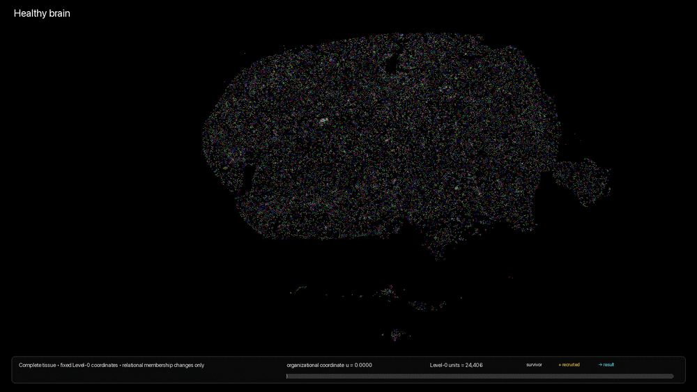

# SUTRA

**Spatial Unified Transcriptomic Reconstruction and Analysis**

<p align="center">
  
</p>

## Part 1 — production

`part1_production/run_sutra.sh` is the single public entry point.

```bash
cd part1_production
./run_sutra.sh --help
./run_sutra.sh --preflight
./run_sutra.sh --run
```

The released five-specimen workflow is a sequential pipeline. Historical stage
numbers are retained only on internal runner filenames to preserve exact
provenance of the validated computation; they are not alternative SUTRA
versions.

Raw data and large resources are not committed. Populate `data/` and
`resources/` before running production.

## Part 2 — paper reproduction

`part2_paper/` contains frozen approved scientific products and canonical
standalone panel-generation code. Main figures are not shipped as assembled
composites. The released movie is retained with provenance; movie regeneration
is not claimed unless its producer is present.

## Naming

The public Python namespace is `sutra`. Legacy `strata` and `strata_hierarchy`
software namespaces are not part of the release interface.
