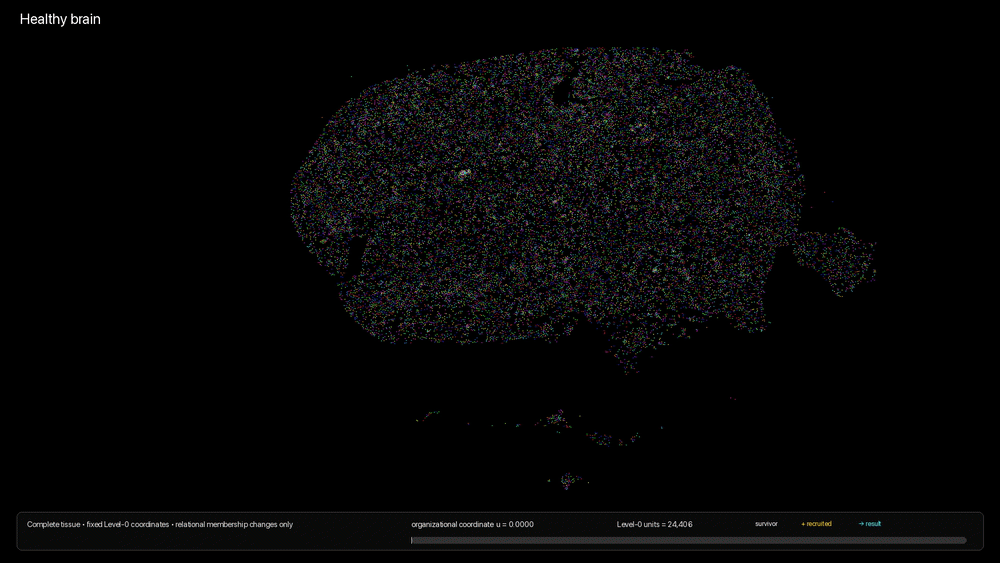

# SUTRA

**Spatial Unified Transcriptomic Reconstruction and Analysis**

**From spatially resolved molecular measurements to multiscale tissue organization.**

SUTRA (सूत्र, *sūtra*, “thread”) is a framework for reconstructing the multiscale organization of tissue from spatial transcriptomic measurements. Rather than treating a spatial transcriptomic experiment only as a matrix of molecular profiles attached to coordinates, SUTRA asks a complementary question:

> **How is tissue organized?**

Starting from measured cells and their spatial and molecular relationships, SUTRA constructs a specimen-local hierarchy in which cells form neighborhoods and progressively larger collective tissue objects. Molecular state, geometry, topology and relational information remain traceable through this hierarchy, providing a description of tissue organization across organizational scale.

<p align="center">
  
</p>

<p align="center"><strong>cells → local relations → collective objects → multiscale tissue hierarchy → relational and biological interpretation</strong></p>

## What SUTRA provides

SUTRA makes tissue organization quantitatively accessible. The released workflow supports specimen-local reconstruction; traceable collective objects; multiscale organizational trajectories; spatial, molecular and relational readouts; downstream cross-specimen relational comparison after independent reconstruction; and frozen paper-reproduction products with audits and provenance.

The coordinate \(u\) indexes **organizational scale**. It is not time, temperature, or a thermodynamic control parameter. SUTRA treats tissues as finite, spatially embedded biological systems and does not require an equilibrium critical-point interpretation.

## Released specimen contexts

| Specimen key | Context |
|---|---|
| `healthy_reference` | healthy brain reference |
| `alzheimers` | Alzheimer's disease brain |
| `gbm_reference_addon` | GBM-related brain reference/add-on context |
| `nondiseased_kidney` | nondiseased kidney |
| `prcc` | papillary renal cell carcinoma kidney |

Brain and kidney are analyzed as distinct biological systems. The shared framework asks which organizational features persist or reorganize across scale without requiring the tissues to share the same molecular programs.

## Repository map

```text
SUTRA/
├── README.md
├── part1_production/
│   ├── run_sutra.sh              # canonical public entry point
│   ├── pyproject.toml
│   └── ...                       # validated internal production stages
├── part2_paper/
│   ├── code/canonical_panels/
│   ├── main/
│   ├── supplementary/
│   ├── movies/                   # five released hierarchy movies
│   └── validate_frozen_products.py
├── docs/
│   ├── getting_started.md
│   ├── data_and_outputs.md
│   ├── reproducibility.md
│   └── assets/
├── SHA256SUMS.tsv
└── test_release.sh
```

Historical stage numbers remain on validated internal runner filenames because they record computational provenance; they are not alternative public SUTRA versions. The canonical public entry point is `part1_production/run_sutra.sh`.

## Quick start

```bash
git clone https://github.com/umdsid/SUTRA.git
cd SUTRA/part1_production

./run_sutra.sh --help
./run_sutra.sh --preflight
./run_sutra.sh --run
```

Raw data and large resources are not committed. Populate the project-level `data/` and `resources/` inputs before production. The released five-specimen workflow is sequential.

See [`docs/getting_started.md`](docs/getting_started.md) and [`docs/data_and_outputs.md`](docs/data_and_outputs.md).

## Paper reproduction

`part2_paper/` separates validated scientific products from the full production workflow. It contains frozen panel products, audits/manifests, supplementary analyses, five hierarchy movies and a frozen-product validator. Panel-level scientific products are retained separately from manuscript composition.

```bash
python part2_paper/validate_frozen_products.py
./test_release.sh
```

## Hierarchy movies

Five hierarchy movies are included in `part2_paper/movies/`: healthy brain reference, Alzheimer's disease brain, GBM-related brain context, nondiseased kidney and PRCC kidney. `MOVIE_MANIFEST.json` is the release manifest.

A committed movie is a frozen release product; movie **regeneration** should only be claimed when the corresponding producer and provenance are present and validated.

## Reproducibility and provenance

SUTRA distinguishes production computation, frozen scientific products, and downstream presentation. Checksums are recorded in `SHA256SUMS.tsv`; additional release/audit documentation is retained under `docs/`.

See [`docs/reproducibility.md`](docs/reproducibility.md).

## Naming

**SUTRA — Spatial Unified Transcriptomic Reconstruction and Analysis**

The public Python namespace is `sutra`. Legacy `strata` and `strata_hierarchy` software namespaces are not part of the release interface.

## Authors

**Siddharth Sharma** and **Sanjay Jain**

## Citation

The manuscript associated with this release is in preparation. A finalized bibliographic citation will be added when available. Until then, cite the repository together with the specific release/commit used for analysis.

## Release status

This repository is a research release tied to validated SUTRA analyses. Scientific products, manifests and provenance records are part of the release record; documentation changes should not silently alter frozen scientific outputs.
